# 🐸 Reddit-Ribbit-Ribbit: Your Friendly AI Reddit Agent 🤖

[](https://github.com/VinsmokeSomya/Reddit-Ribbit-Ribbit.git)

Welcome to **Reddit-Ribbit-Ribbit**! This project is an AI-powered Reddit agent designed to hop into discussions, share some insights (and maybe a frog pun or two! 🐸), and engage with communities using a fun, friendly, and modern voice, including Gen Alpha slang and emojis! ✨

It uses the power of Google's Gemini API for its intelligent comment generation and image understanding capabilities.

---

## 🚀 About The Project

Reddit-Ribbit-Ribbit is a Python-based bot that:

*   👀 **Monitors** specified subreddits for new posts.
*   🔑 Filters posts based on **keywords** in their titles.
*   🧠 **Analyzes** post content, including text, linked URLs, and images.
*   🤖 Uses the **Google Gemini API** (specifically a model like `gemini-1.5-pro-latest` or your configured `gemini-2.5-pro-exp-03-25`) to generate contextually relevant and engaging comments.
*   🗣️ Speaks in a customizable persona, incorporating **Gen Alpha slang** and **emojis** for a modern, quirky vibe.
*   📝 Posts these comments to Reddit, adding a unique voice to discussions.
*   ⏰ Manages a cooldown period to avoid spamming.
*   💾 Remembers posts it has replied to.

**Built With:**

*   🐍 Python
*   🤖 Google Gemini API
*    praw (Python Reddit API Wrapper)
*   📝 Dotenv, Requests, BeautifulSoup4, Pillow

---

## 📊 Workflow: How Reddit-Ribbit-Ribbit Hops In!

```mermaid
graph TD
    A[Start Ribbit Agent 🐸] --> B{Scan Subreddits for New Posts};
    B -- Post Found --> C{Match Keywords in Title?};
    C -- Yes --> D{Time Since Last Comment OK? ⏱️};
    C -- No --> B;
    D -- No --> B;
    D -- Yes --> E[Process Post Content: Text, URLs, Images 🖼️];
    E --> F[Fetch Persona & Brain Files 🧠];
    F --> G[Generate Comment with Gemini AI ✨];
    G --> H[Post Comment to Reddit ✅];
    H --> I[Log Replied Post & Update Timestamp 💾];
    I --> B;
```



**Simplified Workflow:**

1.  **Launch**: Start the `ribbit_agent.py` script.
2.  **Scan & Filter**: The bot checks your chosen subreddits for new posts that match your keywords.
3.  **Cooldown Check**: Ensures it waits a random interval (1-2 hours by default) before commenting again.
4.  **Understand**: If a post is a match and the cooldown is over, the bot reads the post's text. If there are links, it tries to scrape their content. If it's an image post, it downloads and uses Gemini to describe the image.
5.  **Think (with Gemini!)**: It combines the post's info with its "brain" files (`persona_and_instructions.txt`, `good_comment_examples.txt`, etc.) to create a prompt for the Gemini API.
6.  **Craft Reply**: Gemini generates a comment based on all this context, aiming for a helpful, engaging, and on-brand (lowercase, slang, emojis!) response.
7.  **Post & Remember**: The bot posts the comment to Reddit and saves the post ID so it doesn't reply again.
8.  **Repeat**: The cycle continues!

---

## 📁 Project File Structure

```text
        [ Start Ribbit Agent 🐸 ]
                 |
                 v
        +-------------------------+
        |  < Scan Subreddits >    |<---+
        |  <  for New Posts  >    |    | (No Match / Time Not OK / After Logging)
        +-----------|-------------+    |
                    | (Post Found)     |
                    v                  |
        +-------------------------+    |
        |  < Match Keywords  >    | No |
        |  <   in Title?     >    |----+
        +-----------|-------------+
                    | (Yes)
                    v
        +-------------------------+
        |  < Time Since Last >    | No
        |  <  Comment OK? ⏱️>     |---+
        +-----------|-------------+    |
                    | (Yes)            |
                    v                  |
        [ Process Post Content   ]     |
        [ Text, URLs, Images 🖼️ ]      |
                    |                  |
                    v                  |
        [ Fetch Persona &        ]     |
        [   Brain Files 🧠      ]      |
                    |                  |
                    v                  |
        [ Generate Comment with   ]    |
        [     Gemini AI ✨      ]      |
                    |                  |
                    v                  |
        [ Post Comment to Reddit ✅]   |
                    |                  |
                    v                  |
        [ Log Replied Post &      ]    |
        [  Update Timestamp 💾   ]     |
                    |                  |
                    +------------------+

```

---

## 🛠️ Getting Started / Setup

Follow these steps to get Reddit-Ribbit-Ribbit hopping on your machine!

### Prerequisites

*   Python 3.7+ installed.
*   A Reddit account for your bot.
*   A Google Cloud Project with the Gemini API enabled (to get your Google API Key).

### Setup Instructions

1.  **Clone the Repository:**
    ```bash
    git clone https://github.com/VinsmokeSomya/Reddit-Ribbit-Ribbit.git
    cd Reddit-Ribbit-Ribbit
    ```

2.  **Install Dependencies:**
    It's recommended to use a virtual environment:
    ```bash
    python -m venv venv
    source venv/bin/activate  # On Windows use `venv\Scripts\activate`
    ```
    Then install the required packages:
    ```bash
    pip install -r requirements.txt
    ```
    *(Make sure `requirements.txt` includes `google-generativeai` and other necessary packages like `praw`, `python-dotenv`, `requests`, `beautifulsoup4`, `Pillow`)*

3.  **Reddit App Setup:**
    *   Go to [https://www.reddit.com/prefs/apps](https://www.reddit.com/prefs/apps).
    *   Scroll down and click "are you a developer? create an app...".
    *   Fill in the details:
        *   **name:** RedditRibbitRibbit (or anything you like)
        *   **type:** select `script`
        *   **description:** (optional)
        *   **about url:** (optional)
        *   **redirect uri:** `http://localhost:8080` (important for script apps)
    *   Click "create app".
    *   You will get a **CLIENT ID** (under your app name) and a **CLIENT SECRET**.

4.  **Google Gemini API Key:**
    *   Go to the [Google AI Studio](https://aistudio.google.com/) or your Google Cloud Console.
    *   Create an API key for the Gemini API. Refer to the [official Google documentation](https://ai.google.dev/gemini-api/docs/api-key) for the latest steps.

5.  **Environment Variables (.env file):**
    *   Create a file named `.env` in the root directory of the project.
    *   Add your credentials like this (replace `xxx` and `your_..._here` with your actual values):
        ```env
        REDDIT_CLIENT_ID="YOUR_REDDIT_CLIENT_ID"
        REDDIT_CLIENT_SECRET="YOUR_REDDIT_CLIENT_SECRET"
        REDDIT_USER_AGENT="RedditRibbitRibbit v1.0 by YourUsername" # Make this unique and descriptive
        REDDIT_USERNAME="YOUR_BOTS_REDDIT_USERNAME"
        REDDIT_PASSWORD="YOUR_BOTS_REDDIT_PASSWORD"
        GOOGLE_API_KEY="YOUR_GOOGLE_GEMINI_API_KEY"
        ```

6.  **Configure the Bot's Brain 🧠:**
    *   Navigate to the `bot_brain_files/` directory.
    *   Edit the following files to customize Reddit-Ribbit-Ribbit's personality and knowledge:
        *   `persona_and_instructions.txt`: Define how your bot should act, its primary goals, and overall tone. Get creative with its froggy, Gen Alpha persona!
        *   `good_comment_examples.txt`: Provide high-quality examples of comments (with slang and emojis!) you want the bot to emulate.
        *   `knowledge_snippets.txt`: Add any specific facts, frog trivia, or information you want the bot to know.
        *   `output_rules.txt`: Define strict rules for its comments (e.g., sentence length, emoji usage).
        *   `avoid_these_comments.txt`: Give examples of what the bot *shouldn't* say.

7.  **Configure Subreddits & Keywords:**
    *   Open `ribbit_agent.py`.
    *   Modify these lines with your target subreddits and keywords:
        ```python
        subreddits = ["yoursubreddit1", "anothersub", "askreddit"]
        keywords = ["yourkeyword", "another keyword", "help me find"]
        ```

---

## 🟢 Running the Bot

Once everything is configured:

1.  Make sure your virtual environment is activated (if you used one).
2.  Run the script from the project's root directory:
    ```bash
    python ribbit_agent.py
    ```
3.  Watch the console for output! The bot will print the subreddits it's searching and any comments it posts.

---

## 🎨 Customization

*   **Persona & Voice**: The core of customization lies in the `.txt` files within the `bot_brain_files/` directory. Experiment with different instructions, examples, and rules to shape Reddit-Ribbit-Ribbit's unique character.
*   **Targeting**: Change the `subreddits` and `keywords` lists in `ribbit_agent.py` to target different communities and topics.
*   **Comment Frequency**: Adjust the `random.randint(3600, 7200)` values in `ribbit_agent.py` to change the cooldown period between comments (values are in seconds).
*   **Gemini Model**: You can change the Gemini model used (e.g., `gemini-1.5-pro-latest`, `gemini-1.5-flash-latest`, or other specific versions) in `ribbit_agent.py` where `comment_generation_model` and `image_description_model` are initialized.

---

## 🙌 Acknowledgements

*   This project was inspired by and evolved from concepts demonstrated in various AI agent tutorials.
*   Special thanks to the creators of PRAW and the Google Gemini API for their excellent tools.
*   Original YouTube Tutorial (if applicable, you mentioned one earlier): [Link to Tutorial if you have one]

---

Happy Ribbiting! 🐸💬
